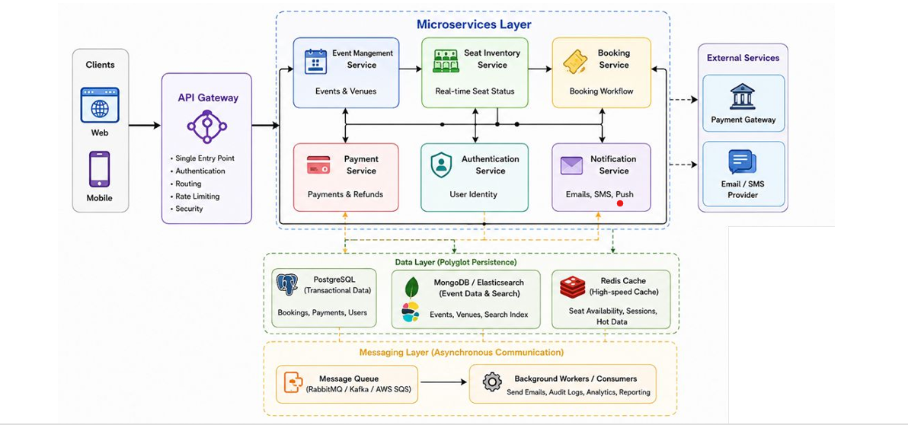

# 🎟️ Ticketing System

A scalable, distributed ticketing platform designed around **microservices**, **polyglot persistence**, **asynchronous messaging**, and integrations with external payment and communication providers.

The architecture separates business capabilities into independently deployable services while using the appropriate data store and communication pattern for each workload.

---

## 📐 Architecture



### High-Level Architecture

```text
Clients
  │
  ▼
API Gateway
  │
  ▼
┌─────────────────────────────────────────────────────────────┐
│                    Microservices Layer                      │
│                                                             │
│  Event Management ──► Seat Inventory ──► Booking Service   │
│         │                    │                    │          │
│         ├──────────────► Payment Service ◄────────┤          │
│         │                    │                               │
│         └──────────────► Authentication Service             │
│                              │                              │
│                         Notification Service                 │
└─────────────────────────────────────────────────────────────┘
          │                    │                    │
          ▼                    ▼                    ▼
     PostgreSQL         MongoDB / Elasticsearch    Redis
          │                    │                    │
          └────────────────────┴────────────────────┘
                               │
                               ▼
                    Message Queue / Broker
                               │
                               ▼
                    Background Workers
                               │
                ┌──────────────┴──────────────┐
                ▼                             ▼
         External Payment              Email / SMS
             Gateway                      Provider
```

---

## 🚀 Key Features

- 🎫 Event and venue management
- 💺 Real-time seat inventory management
- 📅 Booking and reservation workflow
- 💳 Payment processing and refunds
- 🔐 Authentication and user identity management
- 🔔 Email, SMS, and push notifications
- ⚡ Redis-based high-speed caching
- 🔎 Event, venue, and search indexing
- 📬 Asynchronous communication through message queues
- 🧵 Background workers for long-running tasks
- 📊 Audit logs, analytics, and reporting
- 🛡️ API Gateway with centralized security and rate limiting
- 🔌 Integration with external payment and communication providers

---

# 🏗️ System Components

## 1. Clients

The platform supports multiple client applications:

- Web application
- Mobile application

All client requests enter the system through the **API Gateway**.

---

## 2. API Gateway

The API Gateway acts as the **single entry point** for clients.

### Responsibilities

- Request routing
- Authentication
- Authorization
- Rate limiting
- Security
- Request validation
- Forwarding requests to the appropriate microservice

### Example Flow

```text
Web / Mobile
     │
     ▼
API Gateway
     │
     ├──► Event Management Service
     ├──► Seat Inventory Service
     ├──► Booking Service
     ├──► Payment Service
     ├──► Authentication Service
     └──► Notification Service
```

---

# 🧩 Microservices

## Event Management Service

Responsible for managing events and venues.

### Responsibilities

- Create events
- Update events
- Delete events
- Manage venues
- Manage event metadata
- Publish event information

### Data

Event and venue information can be indexed for fast search using:

- MongoDB
- Elasticsearch

---

## Seat Inventory Service

Responsible for maintaining the real-time state of seats.

### Responsibilities

- Track available seats
- Reserve seats
- Release seats
- Update seat status
- Prevent conflicting reservations
- Provide real-time seat availability

### Example Seat States

```text
AVAILABLE
    │
    ▼
HELD
    │
    ▼
BOOKED
```

If a booking expires:

```text
HELD ──► AVAILABLE
```

### Redis

Redis is used as a high-speed cache for frequently accessed information such as:

- Seat availability
- Temporary seat holds
- Session-related data
- Frequently accessed event data

---

## Booking Service

The Booking Service manages the complete booking workflow.

### Responsibilities

- Create bookings
- Validate seat availability
- Coordinate seat reservation
- Initiate payment
- Confirm bookings
- Handle booking failures
- Trigger notifications

### Typical Booking Flow

```text
User
 │
 ▼
API Gateway
 │
 ▼
Booking Service
 │
 ├──► Seat Inventory Service
 │          │
 │          ▼
 │       Reserve Seat
 │
 ├──► Payment Service
 │          │
 │          ▼
 │      Process Payment
 │
 └──► Notification Service
            │
            ▼
       Send Confirmation
```

---

## Payment Service

Handles payments and refunds.

### Responsibilities

- Initiate payments
- Verify payment status
- Process refunds
- Maintain payment records
- Communicate with external payment gateways

```text
Booking Service
      │
      ▼
Payment Service
      │
      ▼
External Payment Gateway
```

The Payment Service isolates payment-provider-specific logic from the Booking Service.

---

## Authentication Service

Responsible for user identity and authentication.

### Responsibilities

- User registration
- Login
- Authentication
- Token management
- Identity management
- Authorization-related information

Other microservices can rely on the authentication layer to validate user identity.

---

## Notification Service

Responsible for sending user notifications.

### Supported Channels

- Email
- SMS
- Push notifications

The Notification Service can consume asynchronous events so that booking and payment operations do not need to wait for notification delivery.

```text
Booking Confirmed
       │
       ▼
 Message Queue
       │
       ▼
Notification Service
       │
       ├──► Email Provider
       ├──► SMS Provider
       └──► Push Provider
```

---

# 💾 Data Layer

The system follows a **polyglot persistence** approach.

Different databases are selected according to the requirements of each workload.

## PostgreSQL

Used for transactional data.

### Example Data

- Users
- Bookings
- Payments
- Transactional records

PostgreSQL provides strong consistency and transactional guarantees for critical business operations.

---

## MongoDB

Used for flexible document-oriented data.

### Example Data

- Events
- Venues
- Event metadata
- Flexible application data

---

## Elasticsearch

Used for search and indexing.

### Example Use Cases

- Search events
- Search venues
- Filter events
- Full-text search
- Fast discovery

```text
Event Management Service
          │
          ├──► MongoDB
          │
          └──► Elasticsearch
```

---

## Redis

Redis provides high-speed caching.

### Example Use Cases

- Seat availability
- Temporary seat holds
- Session data
- Frequently accessed information
- Hot data

```text
Application
    │
    ▼
  Redis
    │
    └── Cache Hit ──► Return Data

Cache Miss
    │
    ▼
Database
```

---

# 📨 Messaging Layer

The system uses asynchronous messaging to decouple services and handle background workloads.

Possible message brokers include:

- RabbitMQ
- Apache Kafka
- Amazon SQS

The exact broker can be selected based on deployment and scalability requirements.

---

## Background Workers / Consumers

Background workers consume messages from the queue and perform tasks that do not need to block the main request.

### Example Tasks

- Sending emails
- Sending SMS
- Audit logging
- Analytics processing
- Reporting
- Other asynchronous jobs

```text
Producer Service
       │
       ▼
 Message Queue
       │
       ▼
Background Worker
       │
       ├──► Email
       ├──► Audit Logs
       ├──► Analytics
       └──► Reporting
```

---

# 🔄 Communication Patterns

The architecture supports two primary communication patterns.

## Synchronous Communication

Used when the caller needs an immediate response.

```text
Client
  │
  ▼
API Gateway
  │
  ▼
Microservice
  │
  ▼
Response
```

Typical use cases:

- Login
- Event search
- Seat availability
- Booking requests
- Payment status

---

## Asynchronous Communication

Used for operations that can happen independently of the main request.

```text
Service
  │
  ▼
Message Queue
  │
  ▼
Consumer / Worker
  │
  ▼
Background Processing
```

Typical use cases:

- Notifications
- Audit logs
- Analytics
- Reporting
- Non-critical background processing

---

# 🎫 Booking Workflow

A simplified booking workflow is:

```text
1. User selects an event
        │
        ▼
2. Check seat availability
        │
        ▼
3. Hold selected seats
        │
        ▼
4. Create booking
        │
        ▼
5. Process payment
        │
        ├── Payment Failed ──► Release Seats
        │
        ▼
6. Confirm booking
        │
        ▼
7. Publish booking event
        │
        ▼
8. Send notification asynchronously
```

### Important Consideration

Seat reservation should be designed to prevent **double booking** under concurrent requests.

A typical approach is:

```text
AVAILABLE
    │
    ├── User A ──► HOLD
    │
    └── User B ──► REJECT
```

Redis-based locking, atomic operations, database constraints, or another concurrency-control mechanism can be used depending on the implementation.

---

# 💳 Payment Flow

```text
Client
  │
  ▼
API Gateway
  │
  ▼
Booking Service
  │
  ▼
Payment Service
  │
  ▼
Payment Gateway
  │
  ├──► Success
  │      │
  │      ▼
  │   Confirm Booking
  │
  └──► Failure
         │
         ▼
    Release Seats
```

Payment-provider-specific implementation should remain inside the Payment Service rather than being exposed directly to other services.

---

# 🔔 Notification Flow

Notifications are processed asynchronously.

```text
Booking Service
      │
      ▼
Booking Confirmed Event
      │
      ▼
Message Queue
      │
      ▼
Notification Service
      │
      ├──► Email Provider
      ├──► SMS Provider
      └──► Push Provider
```

This prevents slow external notification providers from unnecessarily delaying the booking response.

---

# 🗄️ Data Ownership

Each service should ideally own the data required for its business capability.

| Service                  | Primary Responsibility     | Storage                              |
| ------------------------ | -------------------------- | ------------------------------------ |
| Authentication Service   | Users / Identity           | PostgreSQL                           |
| Event Management Service | Events / Venues            | MongoDB / Elasticsearch              |
| Seat Inventory Service   | Seat availability          | Redis + appropriate persistent store |
| Booking Service          | Bookings                   | PostgreSQL                           |
| Payment Service          | Payments / Refunds         | PostgreSQL                           |
| Notification Service     | Notification jobs / status | Service-specific storage             |

> The exact database assignment can be adjusted according to implementation requirements. The key principle is to avoid tightly coupling services through direct access to another service's database.

---

# 🔐 Security

The API Gateway provides the first layer of security.

Recommended security controls include:

- HTTPS/TLS
- Authentication tokens
- Authorization
- Rate limiting
- Input validation
- Request size limits
- Secure HTTP headers
- Service-to-service authentication
- Secrets management
- Payment data isolation
- Audit logging

Sensitive credentials and API keys should never be committed to the repository.

Use environment variables or a dedicated secrets-management solution.

---

# 📈 Scalability

The architecture is designed to scale individual services independently.

For example:

```text
                    Load
                     │
          ┌──────────┴──────────┐
          ▼                     ▼
    Booking Service       Booking Service
       Instance 1            Instance 2
```

Services with high traffic can be horizontally scaled without scaling the entire system.

### High-traffic candidates

- Seat Inventory Service
- Event Management Service
- Booking Service
- API Gateway

Redis can reduce database load, while message queues can absorb asynchronous workloads.

---

# 🛡️ Reliability

Recommended reliability patterns include:

### Idempotency

Important operations such as payment and booking creation should support idempotency to prevent duplicate processing.

```text
Request
  │
  ▼
Idempotency Key
  │
  ├── Already Processed ──► Return Existing Result
  │
  └── New Request ──► Process
```

### Retries

Temporary failures from external services can be retried using controlled retry policies.

### Dead-Letter Queue

Messages that repeatedly fail processing should be moved to a dead-letter queue for investigation and recovery.

### Timeouts

External service calls should have appropriate timeouts to prevent resource exhaustion.

---

# 📊 Observability

A production implementation should provide centralized observability.

Recommended components:

- Structured application logs
- Metrics
- Distributed tracing
- Health checks
- Error tracking
- Request correlation IDs

Example:

```text
Client Request
      │
      ▼
API Gateway
      │
      ▼
Booking Service
      │
      ├──► Seat Inventory
      │
      └──► Payment Service
               │
               ▼
        External Gateway
```

A correlation ID should be propagated across services to make debugging distributed requests easier.

---

# 🧪 Testing Strategy

Recommended testing levels:

## Unit Tests

Test individual functions and business logic.

```text
Service
 └── Unit Tests
```

## Integration Tests

Test service interactions with databases, Redis, queues, and external integrations.

```text
Service
 ├── PostgreSQL
 ├── MongoDB
 ├── Redis
 └── Message Broker
```

## End-to-End Tests

Test complete user workflows.

Example:

```text
Login
  ↓
Search Event
  ↓
Select Seats
  ↓
Create Booking
  ↓
Make Payment
  ↓
Receive Confirmation
```

---

# 📁 Suggested Repository Structure

A monorepo or multi-repository approach can be used.

### Monorepo Example

```text
ticketing-system/
│
├── apps/
│   ├── web/
│   └── mobile/
│
├── services/
│   ├── api-gateway/
│   ├── event-management/
│   ├── seat-inventory/
│   ├── booking/
│   ├── payment/
│   ├── authentication/
│   └── notification/
│
├── workers/
│   ├── email-worker/
│   ├── audit-worker/
│   ├── analytics-worker/
│   └── reporting-worker/
│
├── packages/
│   ├── shared-types/
│   ├── logger/
│   └── config/
│
├── infrastructure/
│   ├── docker/
│   ├── kubernetes/
│   └── terraform/
│
├── docs/
│   └── architecture.png
│
├── .env.example
├── docker-compose.yml
├── package.json
└── README.md
```

---

# ⚙️ Configuration

Create an environment configuration based on `.env.example`.

Example:

```env
NODE_ENV=development

# API Gateway
API_GATEWAY_PORT=3000

# PostgreSQL
POSTGRES_HOST=localhost
POSTGRES_PORT=5432
POSTGRES_DB=ticketing
POSTGRES_USER=postgres
POSTGRES_PASSWORD=change-me

# MongoDB
MONGODB_URI=mongodb://localhost:27017/ticketing

# Redis
REDIS_URL=redis://localhost:6379

# Elasticsearch
ELASTICSEARCH_URL=http://localhost:9200

# Message Broker
MESSAGE_BROKER_URL=amqp://localhost

# External Services
PAYMENT_GATEWAY_URL=
EMAIL_PROVIDER_URL=
SMS_PROVIDER_URL=
```

> Never commit real credentials, API keys, payment secrets, or production connection strings.

---

# 🐳 Local Development

If Docker Compose is used, the supporting infrastructure can be started with:

```bash
docker compose up -d
```

Check running containers:

```bash
docker compose ps
```

Stop the infrastructure:

```bash
docker compose down
```

---

# 🔧 Development Workflow

A typical development workflow:

```text
1. Clone repository
       ↓
2. Install dependencies
       ↓
3. Configure environment variables
       ↓
4. Start infrastructure
       ↓
5. Start services
       ↓
6. Run tests
       ↓
7. Build services
       ↓
8. Deploy
```

---

# 🚢 Deployment

The services can be deployed independently using containers.

A production deployment can use:

- Docker
- Kubernetes
- AWS / Azure / GCP
- Managed PostgreSQL
- Managed MongoDB
- Managed Redis
- Managed Elasticsearch
- Managed message broker

A typical deployment architecture:

```text
                    Internet
                       │
                       ▼
                Load Balancer
                       │
                       ▼
                  API Gateway
                       │
          ┌────────────┼────────────┐
          ▼            ▼            ▼
       Booking       Events       Seats
       Service       Service      Service
          │            │            │
          └────────────┼────────────┘
                       ▼
                Message Broker
                       │
                       ▼
                Background Workers
```

---

# 🧠 Architecture Principles

This system follows several important distributed-system principles:

1. **Separation of concerns** — each microservice owns a specific business capability.
2. **Loose coupling** — services communicate through APIs and events rather than sharing internal implementation details.
3. **Polyglot persistence** — use the right database for the right workload.
4. **Asynchronous processing** — move non-critical work to background consumers.
5. **Independent scalability** — scale high-demand services independently.
6. **Fault isolation** — failures in one component should not unnecessarily bring down the entire platform.
7. **Security by design** — authentication, authorization, rate limiting, and secrets management are considered at the architecture level.
8. **Observability** — logs, metrics, traces, and correlation IDs make distributed failures diagnosable.

---

# 📌 Architecture Summary

| Layer                 | Components                                        | Purpose                                          |
| --------------------- | ------------------------------------------------- | ------------------------------------------------ |
| **Clients**           | Web, Mobile                                       | User interaction                                 |
| **API Layer**         | API Gateway                                       | Routing, authentication, rate limiting, security |
| **Microservices**     | Event, Seat, Booking, Payment, Auth, Notification | Business capabilities                            |
| **Data Layer**        | PostgreSQL, MongoDB, Elasticsearch, Redis         | Persistent storage, search, caching              |
| **Messaging**         | RabbitMQ / Kafka / AWS SQS                        | Asynchronous communication                       |
| **Workers**           | Background Consumers                              | Emails, audit logs, analytics, reporting         |
| **External Services** | Payment Gateway, Email/SMS Provider               | Third-party integrations                         |

---

# 🔮 Future Improvements

Potential future improvements include:

- Kubernetes-based orchestration
- Service mesh
- Distributed tracing
- Event-driven architecture expansion
- Automated seat-lock expiration
- Circuit breakers
- Dead-letter queues
- API versioning
- Centralized configuration
- Feature flags
- Multi-region deployment
- Disaster recovery
- Automated CI/CD
- Real-time seat updates using WebSockets
- Advanced fraud detection
- Recommendation and personalization systems

---

# 👩‍💻 Author

Dhiti Varma

**Ticketing System Architecture**

Built using a microservices-oriented architecture with transactional databases, caching, search infrastructure, asynchronous messaging, and external service integrations.

---

## 📄 License

```text
MIT License
```

if the project is intended to be released under the MIT License.
