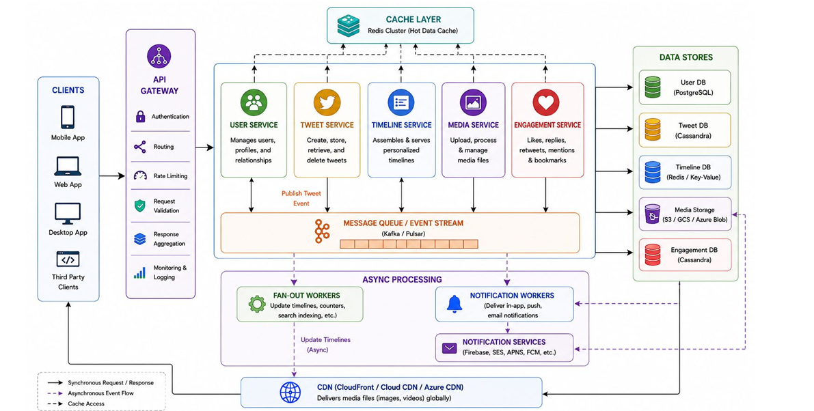

# 🐦 Scalable News Feed / Social Media Platform

A highly scalable, distributed **news-feed and social media platform** inspired by systems such as Twitter/X.

The system is designed to support:

- 👤 User management and profiles
- 📝 Tweet/post creation and retrieval
- 📰 Personalized timelines
- ❤️ Likes, replies, reposts, mentions, and bookmarks
- 🖼️ Media uploads and processing
- 🔔 Real-time and asynchronous notifications
- ⚡ High-performance caching
- 📡 Event-driven asynchronous processing
- 🌍 Globally distributed media delivery through a CDN
- 📈 Horizontal scalability and fault tolerance

---

## 📐 System Architecture

The system follows a **microservices + event-driven architecture**.

### High-Level Architecture

```text
                         ┌──────────────────────────────┐
                         │        CLIENTS               │
                         │                              │
                         │  Mobile │ Web │ Desktop      │
                         │  Third-Party Clients         │
                         └──────────────┬───────────────┘
                                        │
                                        ▼
                         ┌──────────────────────────────┐
                         │        API GATEWAY            │
                         │                              │
                         │ Authentication               │
                         │ Routing                      │
                         │ Rate Limiting                │
                         │ Request Validation           │
                         │ Response Aggregation         │
                         │ Monitoring & Logging         │
                         └──────────────┬───────────────┘
                                        │
                    ┌───────────────────┼───────────────────┐
                    │                   │                   │
                    ▼                   ▼                   ▼
              ┌───────────┐      ┌────────────┐      ┌─────────────┐
              │   User    │      │   Tweet    │      │  Timeline   │
              │  Service  │      │  Service   │      │   Service   │
              └─────┬─────┘      └─────┬──────┘      └──────┬──────┘
                    │                  │                    │
                    │                  │                    │
                    ▼                  ▼                    ▼
              ┌────────────────────────────────────────────────────┐
              │             MESSAGE QUEUE / EVENT STREAM            │
              │                    Kafka / Pulsar                   │
              └────────────────────────┬───────────────────────────┘
                                       │
                    ┌──────────────────┴───────────────────┐
                    │                                      │
                    ▼                                      ▼
             ┌──────────────┐                       ┌──────────────┐
             │ Fan-Out      │                       │ Notification │
             │ Workers      │                       │ Workers      │
             └──────┬───────┘                       └──────┬───────┘
                    │                                      │
                    ▼                                      ▼
             ┌──────────────┐                       ┌──────────────┐
             │   Timeline   │                       │ Notification │
             │    Cache     │                       │  Services   │
             └──────────────┘                       └──────────────┘

```

## 🏗️ Architecture Components

### 1. Clients

The platform supports multiple types of clients:

📱 Mobile Application
💻 Web Application
🖥️ Desktop Application
🔌 Third-Party Clients

All clients communicate with the backend through the API Gateway.

## 🚪 API Gateway

The API Gateway acts as the single entry point for all client requests.

Responsibilities
Authentication
Authorization
Request routing
Rate limiting
Request validation
Response aggregation
Monitoring
Logging

Example Request Flow

Client
│
▼
API Gateway
│
├── Authentication
│
├── Rate Limiting
│
├── Request Validation
│
▼
Microservice
The API Gateway prevents clients from directly communicating with internal services.

## 🧩 Microservices

The core application is divided into multiple independently scalable services.

## 👤 User Service

The User Service manages all user-related functionality.

Responsibilities
User registration
User profiles
User relationships
Follow / unfollow
User metadata
Account information

Data Store
User DB
PostgreSQL
PostgreSQL is used for structured and relational user data.

## 🐦 Tweet Service

The Tweet Service manages posts/tweets.

Responsibilities
Create tweets
Retrieve tweets
Delete tweets
Tweet metadata
Tweet relationships
Publishing tweet events

When a tweet is created, the service publishes an event to the message queue.
User
│
▼
Tweet Service
│
├── Store Tweet
│
└── Publish Tweet Event
│
▼
Kafka / Pulsar

Data Store
Tweet DB
Cassandra

Cassandra is suitable for high-volume, distributed tweet storage.

## 📰 Timeline Service

The Timeline Service is responsible for generating and serving personalized news feeds.

#### Responsibilities

Generate personalized timelines
Retrieve timelines
Maintain timeline ordering
Serve feed data quickly
Handle timeline updates

The system uses a combination of:

Redis caching
Asynchronous fan-out
Event-driven processing

#### Timeline Strategy

Tweet Created
│
▼
Kafka / Pulsar
│
▼
Fan-Out Workers
│
▼
User Timelines
│
▼
Redis
│
▼
Timeline Service
│
▼
Client

## 🖼️ Media Service

The Media Service handles media uploaded by users.

#### Responsibilities

Image uploads
Video uploads
Media processing
Media metadata
Media management

Media files are stored in object storage such as:

Amazon S3
Google Cloud Storage
Azure Blob Storage

The actual media delivery is handled through the CDN.

## ❤️ Engagement Service

The Engagement Service handles interactions with tweets/posts.

#### Supported Operations

❤️ Likes
💬 Replies
🔁 Reposts
@ Mentions
🔖 Bookmarks

#### Data Store

Engagement DB
Cassandra

Cassandra allows engagement data to scale horizontally with high write throughput.

## ⚡ Cache Layer

The system uses Redis Cluster as the primary hot-data cache.

#### Cached Data

User sessions
Frequently accessed tweets
Timeline data
Counters
User relationships
Frequently requested metadata

#### Cache Flow

Service
│
▼
Redis Cluster
│
├── Cache Hit ──────► Return Data
│
└── Cache Miss
│
▼
Database
│
▼
Redis Cache
│
▼
Return Data

Caching significantly reduces database load and improves response latency.

## 📨 Message Queue / Event Stream

The architecture uses an event-streaming platform such as:

Apache Kafka
Apache Pulsar

This layer decouples synchronous API operations from background processing.

#### Example

When a user publishes a tweet:
Tweet Service
│
▼
Tweet Created Event
│
▼
Kafka / Pulsar
│
├──────────────► Fan-Out Workers
│
├──────────────► Notification Workers
│
└──────────────► Other Consumers

This architecture allows consumers to process events independently.

## 🔄 Asynchronous Processing

Background processing is handled asynchronously using workers.

The asynchronous processing layer contains:

┌──────────────────────────────┐
│ ASYNC PROCESSING │
│ │
│ ┌────────────────────────┐ │
│ │ Fan-Out Workers │ │
│ │ │ │
│ │ Timeline Updates │ │
│ │ Counters │ │
│ │ Search Indexing │ │
│ └────────────────────────┘ │
│ │
│ ┌────────────────────────┐ │
│ │ Notification Workers │ │
│ │ │ │
│ │ In-App Notifications │ │
│ │ Email Notifications │ │
│ └────────────┬───────────┘ │
│ │ │
│ ▼ │
│ ┌────────────────────────┐ │
│ │ Notification Services │ │
│ │ │ │
│ │ Firebase │ │
│ │ Amazon SES │ │
│ │ APNs │ │
│ │ FCM │ │
│ └────────────────────────┘ │
└──────────────────────────────┘

## 🚀 Fan-Out Workers

Fan-out workers are responsible for asynchronously updating user timelines.

When a user creates a tweet:
Tweet Created
│
▼
Kafka / Pulsar
│
▼
Fan-Out Worker
│
├── Find Followers
│
├── Update Timelines
│
├── Update Counters
│
└── Update Search Index

The updates are performed asynchronously rather than blocking the tweet creation request.

## 🔔 Notification System

The notification system processes user interactions and generates notifications.

#### Examples

Someone liked your tweet
Someone replied to your tweet
Someone followed you
Someone mentioned you
Someone reposted your tweet

#### Flow

Engagement
│
▼
Event Stream
│
▼
Notification Worker
│
▼
Notification Service
│
├── Firebase
├── Amazon SES
├── APNs
└── FCM
│
▼
User

## 🗄️ Data Stores

The architecture uses different storage technologies based on workload requirements.

| Data        | Storage               | Reason                         |
| ----------- | --------------------- | ------------------------------ |
| Users       | PostgreSQL            | Relational and structured data |
| Tweets      | Cassandra             | High-volume distributed writes |
| Timelines   | Redis / Key-Value     | Extremely fast feed retrieval  |
| Engagements | Cassandra             | High-scale interaction data    |
| Media       | S3 / GCS / Azure Blob | Large binary objects           |
| Cache       | Redis Cluster         | Low-latency hot data           |

## 🗃️ Database Design

User Database
PostgreSQL

Users
├── id
├── username
├── email
├── profile
├── created_at
└── updated_at

### Tweet Database

Cassandra

Tweets
├── tweet_id
├── user_id
├── content
├── media_ids
├── created_at
└── metadata

### Timeline Store

Redis

timeline:{user_id}

[
tweet_id,
tweet_id,
tweet_id,
...
]
The timeline can be retrieved directly from Redis for low-latency feed requests.

### Engagement Database

Cassandra

Likes
Replies
Reposts
Mentions
Bookmarks

## CDN

Media files are delivered globally through a Content Delivery Network.

Supported CDN providers can include:

Amazon CloudFront
Google Cloud CDN
Azure CDN

### Media Request Flow

Client
│
▼
CDN
│
├── Cache Hit
│ │
│ ▼
│ Return Media
│
└── Cache Miss
│
▼
Object Storage
│
▼
CDN Cache
│
▼
Client

This reduces latency for users accessing images and videos from different geographical regions.

## Synchronous vs Asynchronous Communication

The system uses both synchronous and asynchronous communication.

### Synchronous Requests

Used when the client requires an immediate response.

Examples:

Client
│
▼
API Gateway
│
▼
Tweet Service
│
▼
Tweet DB
│
▼
Response

### Asynchronous Events

Used for operations that don't need to block the user's request.

Examples:

Fan-out timeline updates
Notification delivery
Counter updates
Search indexing
Background media processing

Service
│
▼
Kafka / Pulsar
│
▼
Worker
│
▼
Background Processing

## 🧵 Tweet Creation Flow

A typical tweet creation request works as follows:
User
│
▼
API Gateway
│
▼
Tweet Service
│
┌───────┴────────┐
│ │
▼ ▼
Tweet DB Redis Cache
│
▼
Tweet Created Event
│
▼
Kafka/Pulsar
│
┌───┴───────────────┐
│ │
▼ ▼
Fan-Out Workers Notification Workers
│ │
▼ ▼
Timeline Cache Notification Service

The user receives the tweet creation response without waiting for all background operations to finish.

## 📰 Timeline Retrieval Flow

When a user opens their news feed:

User
│
▼
API Gateway
│
▼
Timeline Service
│
▼
Redis
│
├── Cache Hit
│ │
│ ▼
│ Timeline
│
└── Cache Miss
│
▼
Timeline Store / DB
│
▼
Redis
│
▼
Timeline
│
▼
User

This allows the system to serve frequently accessed timelines with very low latency.

## ❤️ Engagement Flow

Example: user likes a tweet.

User
│
▼
API Gateway
│
▼
Engagement Service
│
├── Store Like
│
└── Publish Event
│
▼
Kafka/Pulsar
│
├──────────────► Notification Worker
│
└──────────────► Counter Worker
The interaction is persisted while secondary processing happens asynchronously.

## 📈 Scalability

The architecture is designed for horizontal scalability.

Each microservice can be independently scaled based on traffic.

                    API Gateway
                         │
          ┌──────────────┼──────────────┐
          │              │              │
          ▼              ▼              ▼
     Tweet Service  Timeline Service User Service
       × N             × N             × N

For example:

Tweet Service
├── Instance 1
├── Instance 2
├── Instance 3
└── Instance N

This allows individual services to scale without scaling the entire application.

## ⚖️ Load Distribution

A load balancer can distribute requests across multiple instances.
API Gateway
│
▼
Load Balancer
│
┌────────────┼────────────┐
▼ ▼ ▼
Service 1 Service 2 Service 3

This provides:

Horizontal scalability
Better availability
Fault isolation
Improved throughput

## 🛡️ Fault Tolerance

The system is designed to avoid single points of failure.

Strategies
Multiple service instances
Distributed databases
Redis Cluster
Kafka/Pulsar replication
Asynchronous processing
CDN caching
Database replication
Health checks
Retry mechanisms
Dead-letter queues

If a worker temporarily fails, the event can be retried without affecting the user's primary request.

## 🔁 Event-Driven Architecture

The platform heavily relies on events.

Example Events
TweetCreated
TweetDeleted
TweetLiked
TweetReplied
TweetReposted
UserFollowed
UserMentioned
MediaUploaded

Events can be consumed by multiple independent services.

                    TweetCreated
                         │
                         ▼
                  Kafka / Pulsar
                         │
             ┌───────────┼───────────┐
             │           │           │
             ▼           ▼           ▼
          Timeline   Notification   Search
           Worker       Worker       Worker

This makes the architecture loosely coupled and easier to scale.

## 🚦 Rate Limiting

The API Gateway provides rate limiting to protect backend services.

Example:

Client
│
▼
API Gateway
│
├── Request Count
│
├── Rate Limit Check
│
├── Allowed ──────► Service
│
└── Exceeded ─────► HTTP 429

Rate limiting helps prevent:

API abuse
Accidental traffic spikes
DDoS amplification
Excessive resource consumption

## 🔐 Authentication & Authorization

Authentication is handled at the API Gateway.

A typical flow:

Client
│
▼
Login
│
▼
Authentication Service
│
▼
Access Token
│
▼
API Gateway
│
▼
Validate Token
│
▼
Microservice

Authorization rules determine which resources a user can access or modify.

## 📊 Monitoring & Logging

The API Gateway and backend services should provide centralized observability.

Metrics
Request latency
Requests per second
Error rate
CPU usage
Memory usage
Database latency
Cache hit ratio
Kafka/Pulsar lag
Worker processing time
Logging

Important events should be logged centrally.

Client Request
│
▼
API Gateway
│
├── Request Logs
├── Error Logs
└── Performance Metrics

## 📌 Architecture Diagram


